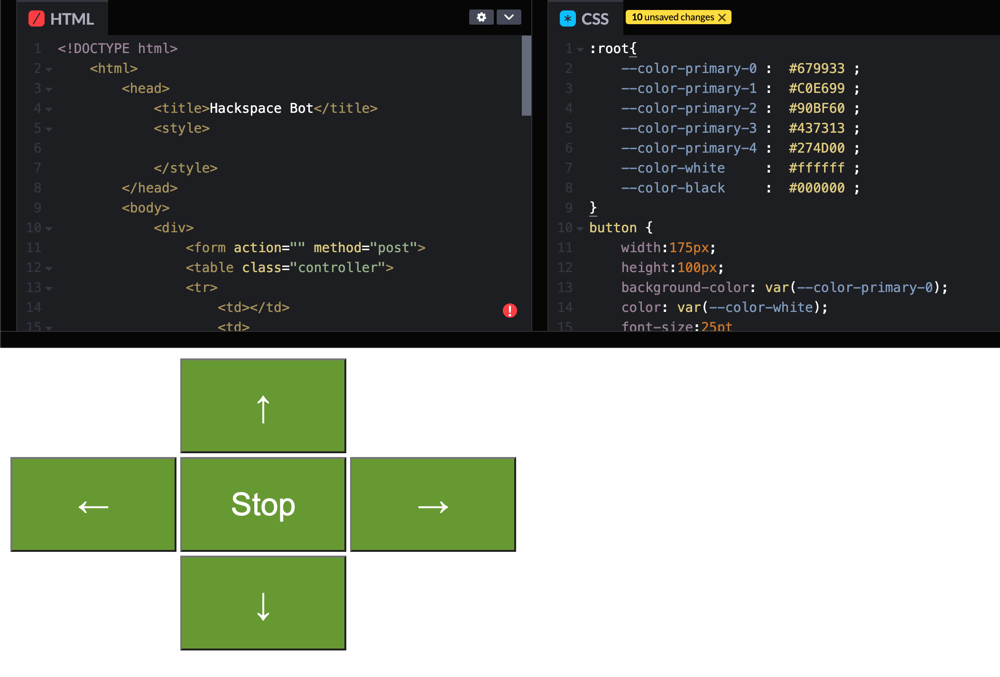
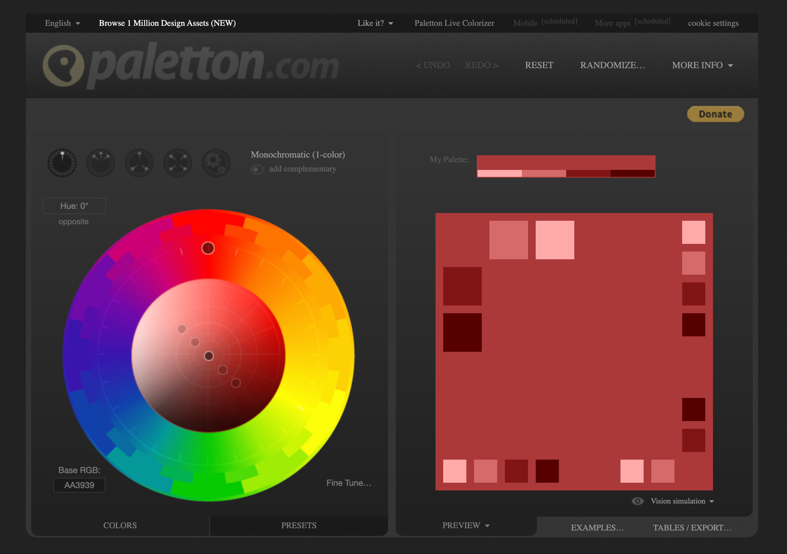
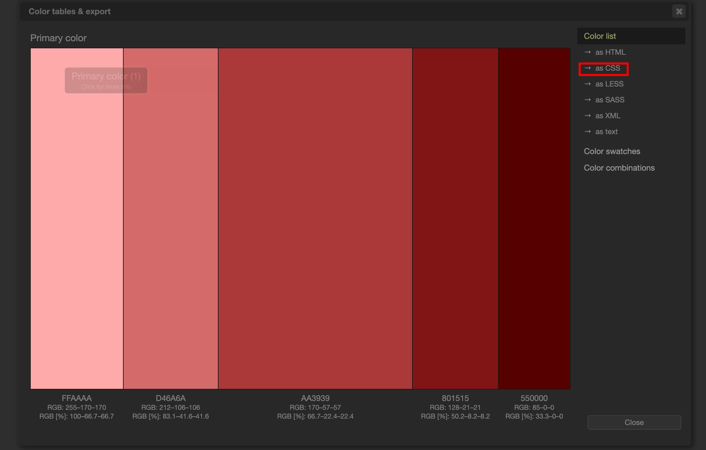

# Continuing the Bot Building Process
So we'll continue from where we left on last a little while ago with our bot building blog [posts][1]. 
We'd got to the MK IV if memory serves... next on the list of things to do is to make our bot interface page nice and pretty.

## Enter, CSS
Because we're using a very simple webserver on the [Raspberyy Pi Pico W][2] and because the code handily returned from our `generateHTML()` function is effectively the page that's served by the websever; we know this is a pretty good place to add a little customisation for our robot - make our page a little ... prettier :).

## CodePen
when prototyping it's always much more satisfying to see the changes happen quickly as opposed to editing our `generateHTML()` function, uploading to the bot, connecting to our bot, visiting the url... it's a lot of steps - to to make this a bit easier we're going to use a nice tool called [CodePen][3], our first step is to rip out the HTML from the `generateHTML()` function and paste it into the HTML window like so:


We've made a couple of modifications from our original `generateHTML()` function to make it easier to work with CSS:

```python
html = f"""
    <!--Snip-->
    <style>{style}</style>
    <!--Snip-->"""
return html
```

The above code is snipped for brevity but what it does is uses python's format string fucntionality to add the variable `style` with the the style we read into the variable (more on that a little later).

We've also moved `generateHTML()` into it's own file and use parameters to drop in from the main program, we import the function into `main.py` by adding the following code to the top of our `main.py`:

```python
from html import generateHTML
```

This allows us to call `generateHTML()` like we did previously, it's just tidied away in its own file now :)... We've also added the following code to the beginning of the function - which will allow us to use an _exteral_ style sheet (see I told you more on that later):
```python
style = ""
with open("./style.css","r") as f:
    style = f.read()
```
Now, once we're done with making the code look _pretty_ in CodePen we can just drop the code from the _CSS_ window into the `style.css` file and it will make the controller page all nice and pretty too! Great Stuff!

## Paletton
A good place to grab some colours that go well together is [Paletton][3], For the purposes of this guide however we're only going to pick a primary colour but don't let that stop you from adding a little extra flare, pick a colour you like the look of like so:


Then, go to the export and select _as CSS_:

Don't worry if the export doesn't work as all the relevant colour information (Hex values) can be grabbed right off this page too!
You should end up with something like this in your `style.css` file:
```css
:root{
    --color-primary-0 :  #679933 ;
    --color-primary-1 :  #C0E699 ;
    --color-primary-2 :  #90BF60 ;
    --color-primary-3 :  #437313 ;
    --color-primary-4 :  #274D00 ;
    --color-white     :  #ffffff ;
    --color-black     :  #000000 ;
}
button {
    width:175px;
    height:100px;
    background-color: var(--color-primary-0);
    color: var(--color-white);
    font-size:25pt
}
```

Where the `:root` _selector_ contains the variable namnes used for the colours - you don't have to do it exactly like this but it's done here for clarity


Thanks for reading!
PW

[1]: https://www.leighhack.org/blog/2024/the-hackbots-project/ "Original Hackbot Adventures"
[2]: https://www.raspberrypi.com/documentation/microcontrollers/raspberry-pi-pico.html "Raspberry Pi Pico"
[3]: https://codepen.io/pen/ "CodePen"
[4]: https://paletton.com/ "Paletton"