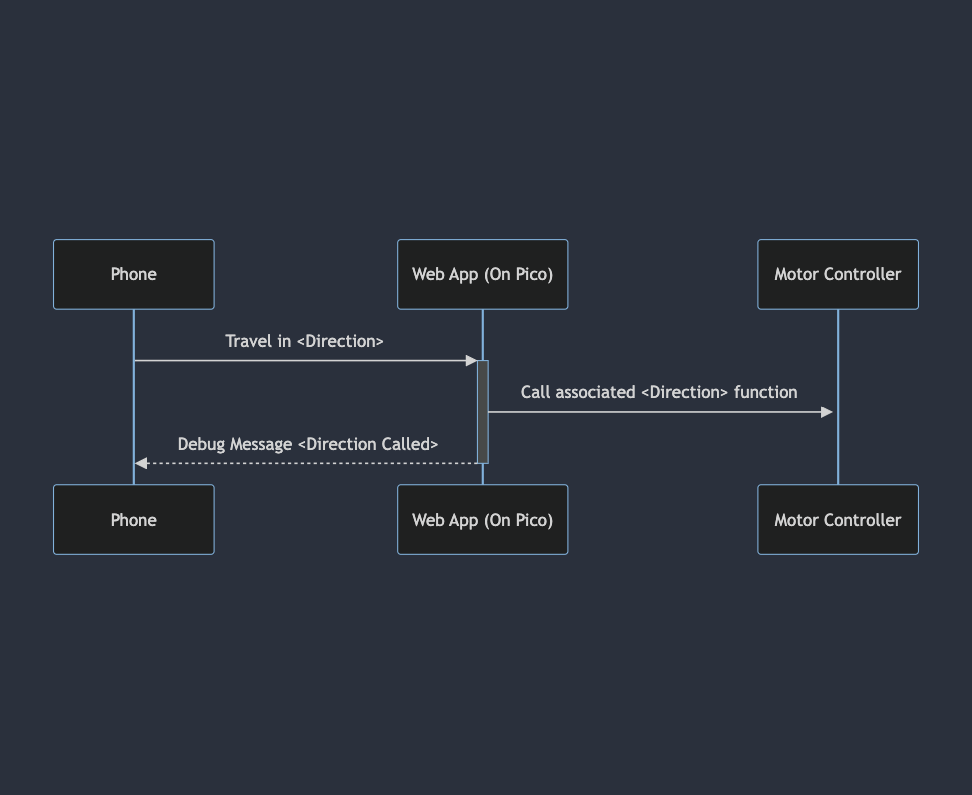
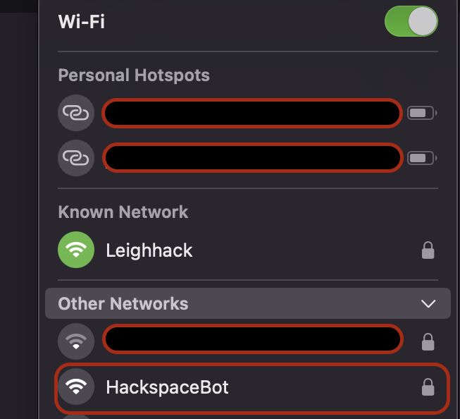

# The Beginning
We'll start at the beginning, after all, it is the very best place to start!

The inspiration for the robots came from wanting to make a simple project using fairly _off the shelf_ and _reasonably priced_ parts that young people could also get their hands on and follow allong with. 

_Note: This post has been written a little "after the fact" so some parts will be skipped... for brevity_ 

# The Prototype
The initial prototype used the following components
- [Raspberry Pi Pico][1] * 1
- [L29XN Motor Controller][2] * 1
- [DC motors][3] * 2 
- [Bluetooth Module][4] * 1
- [Breadboard][5] * 1
- A Piece of wood (to strap all the relevant bits too)
- A Caster (ideally, roughly the same size as the wheels attached to the DC motors)

So, the initial idea was to connect up the Bluetooth Module to the Pico and read data coming _over_ bluetooth to send signals based on the data - if the _forward_ command was sent over bluetooth, call the _forward_ function, sounds super simple right? right!

Below is an a code snippet of the functions (if you're following along i'd suggest having the [Github Repo][6] open in a different tab)

```python
from machine import Pin,PWM,UART 
import time 

uart= UART(0,9600)

In1=Pin(6,Pin.OUT)  #IN1
In2=Pin(7,Pin.OUT)  #IN2
In3=Pin(4,Pin.OUT)  #IN3
In4=Pin(3,Pin.OUT)  #IN4

EN_A=PWM(Pin(8))
EN_B=PWM(Pin(2))
# Defining frequency for enable pins
EN_A.freq(1500)
EN_B.freq(1500)

# Set maximum duty cycle, well go with max speed for now! (0 to 65025)
EN_A.duty_u16(65025)
EN_B.duty_u16(65025)

# Backward
def move_backward():
    print("Back up Back up")
    In1.low()
    In2.high()
    In3.low()
    In4.high()
    
# Forward
def move_forward():
    print("Onwards!")
    In1.high()
    In2.low()
    In3.high()
    In4.low()
        
# Stop
def stop():
    print("All Stop")
    In1.low()
    In2.low()
    In3.low()
    In4.low()

while True:
if uart.any(): #Checking if data available
    data=uart.read() #Getting data
    data=str(data) #Converting bytes to str type
    print(data)
    if('forward' in data):
        move_forward() #Forward
    elif('backward' in data):
        move_backward() #Backward
```
Below is the initial schematic:



As you can see above, this is roughly how the prototype fit together ... you connected to the bluetooth module, send the correct commands, the pico reads them over _[uart][7]_ and calls the respective functions... well that was the plan at least - it turns out that iOS devices don't work as _out of the box_ as android devices when it comes to serial over bluetooth shenanigans, so back to the drawing board on how we get the signals - after all it's no good to us if only some kids can use it! the idea was it could be done all by your phone.

# MK II, III, and IV
So, now we've a relative idea of how it fits together we've got to overcome the issue of only being able to control robots using androids [is that meta?].

`MK II` we tried an ESP32 instead of the Pico and HC-05 combination... same issue it didn't like iOS devices :( .

In `MK III` we tried to use a different bluetooth module with a bluetooth pad, but quickly felt that this process was a little too involved for the simple pick it up and play style we were going for.

`MK IV`! we settled for replacing the Pico with a Pico W so that the wireless comms are all in the one (relatively cheap) package and instead of listening for serial commands over bluetooth; switched to using the WiFi that the Pico W has and created our very own web server, with the contols on it! - this has the added bonus of being able to customise the look [to some extent] as well as being _i-device_ compatible ... I'd call that a win!

# MK IV Explained
With our Pico W wired in we needed to make some modifications to the program running on the Pico - thankfully most of it can stay the same - that's the handy thing about writing things in functions they're all nice and contained and you can just change the way you call them rather than reimplementing them.

The main change is that instead of using bluetooth to communicate over serial we're now using the web server (this means upgrading to the Pico W for it's handy wireless functionality) to do the _talking_ and we just interact with _it_

Below is a very basic sequence diagram of how this works - did I mention it was basic?



Now that we've got the idea for how the communication works we can start to build the web _frontend_ for our bot... Keeping in mind that all the control functionality we already have from the `MK I` to `MK III` we just need to change the way the Pico [W now that we've _upgraded_] gets the instructions to _call_ the functions we need, we can think of this somewhat like the _frontend_ and _backend_ of any other web app really!

### Connecting to the Pico W
So first things first; we need to configure the wireless functionality of our Pico W, I've opted to do this by using splitting this out into it's own file [secrets.py][8].
An example `secrets.py` could be as follows:
```python
config = {
    'ssid': 'Hackbot',
    'pw': 'wonderful password'
    }
```

By keeping the config _dictionary_ in a separate file we can add this file to our `.gitignore` to avoid checking in our password for our config, we can then read these config values with the following code

```python
from secrets import config
# SNIP
# ...
ssid = config['ssid']
password = config['pw']
```

This would read the config files in to variables which our code can then _use_.

_Note: You don't necessarily need to name the dictionary in `secrets.py` `config` ... you don't even need to name the file `secrets.py`!_
_Just make sure what ever you name it is reflected in the `from <secrets.py> import <config>` statement_

Now that we've got our config data into our main program file we can use this data to set up our Wifi access point on the Pico W, this is done by using code like:
```python
ap = network.WLAN(network.AP_IF)
ap.config(essid=ssid, password=password)
ap.active(True)

while ap.active() == False:
  pass

print('Connection successful')
print(ap.ifconfig()) 
```
If your Pico is powered, you should now see it broadcasting an SSID like this:



Fantastic!

### Creating the Web app
The web application doesn't need to be anything fancy, after all we're going to just send get requests and read the URL for the direction.

So, the initial webserver is created using a [socket][9] like so:

```python
import socket
# SNIP
addr = socket.getaddrinfo('0.0.0.0', 80)[0][-1]
s = socket.socket()
s.bind(addr)
s.listen(1)

```

This sets up a socket and begins _listening_; next, we need to create a webpage for it to _serve_. We can use python here too as it allows us to generate something a little more _dynamic_ later on; but for now, we'll just have the `generateHTML()` function return some static html:


```python
def generateHTML():
    return """<!DOCTYPE html>
    <html>
        <head> 
            <title>Hackspace Bot</title> 
            <style>
            button {
                width:175px;
                height:100px;
                background-color:#0000ff;
                color:#ffffff;
                font-size:25pt
            }
            </style>
        </head>
        <body>
            <div>
                <form action="" method="post">
                <table class="controller">
                <tr>
                    <td></td>
                    <td>
                        <button type="submit" formaction="forwards">&#8593</button>
                    </td>
                    <td></td>
                </tr>
                <tr>
                    <td><button type="submit" formaction="left">&#8592</button></td>
                    <td>
                        <button type="submit" formaction="stop">Stop</button>
                    </td>
                    <td>
                        <button type="submit" formaction="right">&#8594</button>
                    </td>
                </tr>
                <tr>
                    <td></td>
                    <td>
                        <button type="submit" formaction="backwards" >&#8595</button>
                    </td>
                    <td></td>
                </tr>
                </table>
            </div>
            """

```

Finally we want to set up a loop that parses data from the website requests to decide which direction to go in this is achieved like so:

```python
while True:
    try:
        led.toggle() # this toggles the LED on the Pico on and off so we have some external sign that things are working
        cl, addr = s.accept()
        print('client connected from', addr)
        request = cl.recv(1024)
        data = str(request)
        direction = (data[1:20].split(' ')[1].replace('/','')) # this extracts the direction from the _end_ of the url in the POST request.
        
        if(direction =='forwards'):
            move_forward()
        elif(direction == 'left'):
            turn_left()
        elif(direction == 'right'):
            turn_right()
        elif(direction == 'backwards'):
            move_backward()
        elif(direction == 'stop'):
            stop()
            
        cl.send('HTTP/1.0 200 OK\r\nContent-type: text/html\r\n\r\n')
        time.sleep(0.2)
        cl.send(generateHTML())
        cl.close()
```

What the above code does is accepts connections from clients (`cl`) of the Wifi access point and sends the control web page to them... from there, users issue commands via the buttons on the webform.

The whole project code is available on the [Github repo][6]

Thanks for reading!

[1]: https://www.raspberrypi.com/documentation/microcontrollers/raspberry-pi-pico.html "Raspberry Pi Pico Family"
[2]: https://components101.com/modules/l293n-motor-driver-module "L29xN Motor Controller"
[3]: https://www.amazon.co.uk/dp/B07VBXXT9M/ref=cm_sw_r_api_i_BB50HXYKHPBAT04PZ3PT_0 "DC Motors"
[4]: https://components101.com/wireless/hc-05-bluetooth-module "HC-05 Bluetooth Module"
[5]: https://www.ebay.co.uk/itm/203599232851 "Solderless breadboard"
[6]: https://github.com/leigh-hackspace/hackspace-bots "Project Code"
[7]: https://en.wikipedia.org/wiki/Universal_asynchronous_receiver-transmitter "UART"
[8]: https://github.com/leigh-hackspace/hackspace-bots/blob/main/example_secrets.py" "Secrets.py"
[9]: "https://docs.python.org/3/library/socket.html" "Python Sockets"