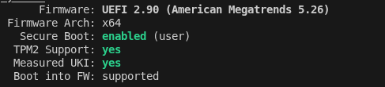

## WHY?
I've been using [NixOS][1] for my day job for a good while now ... I think I first started using it when one of the other hackspace members mentioned it - shout out to chris and I thought it would be a good idea to have a standardised testing VM which comes bundled with all the tools I need day to day; that way if my VM died I could quickly grab [my config][2], redeploy it, and be ready to get going again fairly quickly!

More recently however, it's becoming increasingly obvious [to me at least] that windows is "_not the one_"; sure it's great for all my games (and apparently noise filtering) but more and more often these days the updates try to shoe-horn copilot into something, or make _improvements_ to programs that need no improvements... looking at you [notepad][3]. So I'm going to do my best to jump in both feet and go NixOS as my daily driver; do I expect some teething issues? absolutely! but what fun is technology when it all just works out the box? isn't it more _satisfying_ if you have to spend ~hours~ a little time figuring it out? don't you feel like you've earned it that way? 

## First off, secure boot
In order to boot into the NixOS installer we have to turn off secure boot for a little while; note, this only applies if you're wanting to dual boot windows (for gaming and all that fun stuff whilst you're ~struggling~ acclimatising to NixOS - you can get games to run on it I hear but that might be the the contents of another blog post).

So anyway, we've disabled secureboot - popped our shiny NixOS live cd/USB/carrier pidgeon in and we've installed the base system I'll leave that as an exercise to the reader what desktop environment to go with (in this case I went with cinnamon). 

When going through the installer I created a _separate_ boot drive for Linux (I've been burned too many times by windows updates hosing the boot config in the past) which you can do in the partition editing screen, I went with a 2GB boot partition and a 200 GB ext4 (NixOS) partition but you can create bigger or smaller partitions depending on your need.

By adding a separate boot partition instead of using the existing windows one this _will cause some initial headaches_ as you'll have to select _windows boot manager_ as opposed to _Linux boot manager_ in the boot options in UEFI but that's super easy to do and not REALLY a problem at all.

Once the initial install is done you're going to want to add `vscode` and `git` to the `configuration.nix` file located in `/etc/nixos` and then run the following command `sudo nixos-rebuild switch` this will install both vscode and git into our initial config and make the next steps much easier

## Going from initial install to something more substantial
Now we have git installed clone down [my config][2] `git clone https://github.com/phyushin/nixConfig`, cd into the directory, edit the config (there's a readme in there to help with parts to change) and then apply the config - this will take a while as it's installing a lot of different tools - I'll probably revisit this at some point and make it more modular - again maybe another blogpost!
you apply the config using the following command

```bash
sudo nixos-rebuild switch --flake .#gridania
```
you can edit the configuration with your own details, heck it's probably a good idea to do it that way - so in this case clone the _gridania_ folder rename it to whatever your desired host name is and make the necessary edits to the `nixosConfigurations` element (line 51 in flake.nix) - make sure to copy the `hardware-configuration.nix` from `/etc/nixos` over the existing file (as that one won't match your hardware). you'll want to replace the username with your username too so just find and replace `phyu` with your username and make sure in you're `<hostname>` folder you replace gridania with what ever your host name will be... again this will get tidied up in a later itteration but I'm just putting my thoughts down on the outline of the process for now!

Once we're all installed we need to use a couple of tools `bootctl` and `sbctl` we'll need these for the next part

## Creating keys and other fun stuff

First of all reboot into UEFI back up your current keys in the secure boot section of your UEFI/BIOS and then clear them - we're doing this as we're going to add our own!

Once booted back into NixOS we want to check the status of secure boot this can be done using the following command:

```bash
sudo bootctl status
```
It should show something like this, but with secureboot showing as `disabled (setup)`



Next, we can generate new keys, and then sign them
```bash
sudo sbctl create-keys; sudo sbctl enroll-keys --microsoft
```

Once the keys are enrolled, we can use them to `sign-all` the boot entries using and then verify them

```bash
sudo sbctl sign-all; sudo sbctl verify
```


## Removing old entries in the boot menu

First off, elevate to root `sudo su`
then list the entries in /boot/efi/Linux

```bash
ls /boot/efi/Linux/

```
This folder can get unweildly the more entries are in it so it's best to keep an eye on it and remove outdated entries once you're sure the current config works you can do it like so: 

```bash
rm nixos-generation-1*.efi #remove all entries that start with a 1 
```


Hopefully this has been useful!

Phyu

[1]: https://nixos.org/
[2]: https://github.com/phyushin/nixConfig
[3]: https://msrc.microsoft.com/update-guide/vulnerability/CVE-2026-20841
