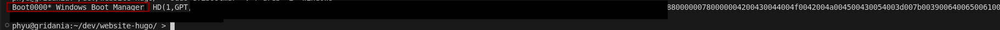

## Why, again?
I've been using [NixOS][1] for my day job for a good while now ... I already mentioned that in a [Previous Post][2], including posting my [config][3] for others to play around with and hopefully get up and running with some dual boot fun in an effort to move away from Windows 11 and the ever growing amount of AI "improvements" (think copilot, recall, etc.) - but i ranted about all that in my previous post about NixOS so we'll not do it here!

## A bit of background
If you followed my previous post, you'll already kind of know how I ended up setting up my machine (if not, the boot order in UEFI is set to linux secure boot; when I want to boot windows, I reboot my machine and mash the F2 key to override boot settings in the UEFI to "windows boot" or what ever it's actually called) and off we go booting into windows.

After doing this for the 100th time or so, I remembered a [post][4] about creating a reboot shortcut in ubuntu 18 for basically this same problem; only difference being that was booting windows 10 and using GRUB - but we're not using GRUB so that'll not work quite the same! but the basic logic will be the same just the implementation will be a bit different.

## Getting started

First things first, we need to get the position of the windows boot manager we can do that using the following command:

```bash
sudo efibootmgr -v | grep -i "windows"

```
This will show something like the following:


So now we know our boot entry is `Boot0000*`, we want temporarily overwrite the "nextboot" to be windows position, then reboot the machine - this is pretty trivial to do, reading the `efibootmgr`'s man page we can use the `-n` flag to specify the next boot using the boot value we already have `0000` from the `Boot0000*` entry in the previous command's output we end up with something like the below:

```bash
#!/bin/sh

sudo efibootmgr -n 0000 1>/dev/null # set the `bootnext` flag to 0000 whilst redirecting the output to /dev/null
sudo shutdown -r now  # reboot machine

```

If you drop this code into a script file called `boot-to-windows` and run it, [don't forget to `chmod +x` it to make it executable] you _should_ reboot into windows!

## Making it a bit more of a shortcut
Sure, you could just sudo to execute that script every time you want to boot in to windows but we want to click it as a shortcut so we still need to set up a couple of things the first is moving that script to `/opt/`... simple enough really `sudo mv boot-to-windows /opt/boot-to-windows`; we should also make this file locked down to the root user - don't want to have accidental privesc scripts laying around on our host:

```bash
sudo chown root:root /opt/reboot-into-windows
sudo chmod 755 /opt/reboot-into-windows
```

Next we want to create a file on the desktop (this will be the _actual_ shortcut) and in it, put the following:

```bash
#!/bin/sh
sudo /opt/reboot-into-windows
```

And make it executable `sudo chmod +x ~/Desktop/reboot2win`

## Adding the command to the sudoers file - NixOS edition
Finally we want this shortcut to be able to run without requiring the password, this is a little different than how you'd do it in ubuntu though we need to edit our `configuration.nix` - so open it up and find the `security` node and add the following

```nix
    sudo = {
      enable = true;
      extraRules = [{
        users=["phyu"]; # where phyu is your username
        runAs ="ALL:ALL";
        commands=[
          {command = "/opt/reboot-into-windows"; options = ["NOPASSWD"];}
          ];
        }];
      }; 
```

After that rebuild your NixOS config and check `/etc/sudoers` you should see you're user now has an entry in there that looks something like this:
```bash
phyu     ALL=(ALL:ALL)    NOPASSWD: /opt/reboot-into-windows
```

Now that's all done you should be able to just double click your shortcut and reboot into windows - without using your linux password

Hopefully this has been useful!

Phyu

[1]: https://nixos.org/
[2]: https://www.leighhack.org/blog/2026/nixos-baremetal-fun/
[3]: https://github.com/phyushin/nixConfig
[4]: https://rastating.github.io/creating-a-reboot-into-windows-button-in-ubuntu/
